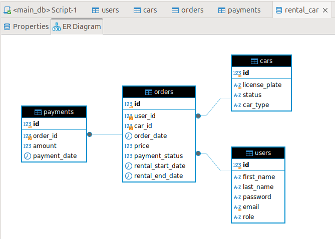

Use ```docker compose``` or ```docker-compose``` command depending on your version of docker compose.

# Startup
1. rename ```.env_example``` to ```.env```.
2. run ```docker compose up --build```.

# Start of use
1. You need to register at /auth/registration
2. You need to log in at /auth/login


# Available URLs
You can see all endpoints in swagger using this route: /docs/

1. /auth/registration [POST] - new user registration.
2. /auth/login [POST]
3. /auth/logout [POST]
4. /user/ [GET] - get user information.
5. /user/ [PUT] - update user information.
6. /user/ [DELETE] - delete user and logout.
7. /cars/ [GET] - find available car for rent by filter.
8. /order/ [POST] - creating a car rental order.
9. /order/ [GET] - find a previously created order.
10. /order/get_by_id [GET] - get order by id.
11. /admin/cars [GET] - find a car by filter (administrator only).
12. /admin/cars [POST] - register new car (administrator only).
13. /admin/cars [PUT] - update car information (administrator only).
14. /admin/cars [DELETE] - update car information (administrator only).
15. /admin/orders [GET] - get all records (administrator only).


# Source for create temp email
https://ethereal.email/create

# ERP Diagram
